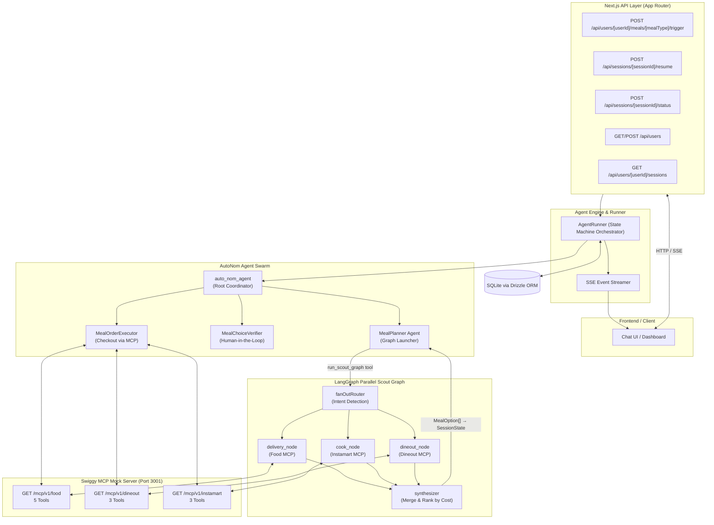
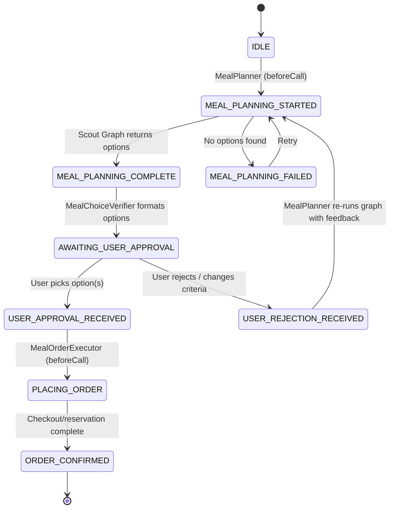

# AutoNom Backend — Multi-Agent Meal Ordering System

A next-generation autonomous multi-agent backend built with **Next.js (App Router)**, **TypeScript**, **Google Gemini 2.5 Flash (`@google/genai`)**, **LangGraph**, and **Drizzle ORM + SQLite**.

The backend manages end-to-end meal planning across three Swiggy modalities — **Food Delivery**, **Instamart (Cook at Home)**, and **Dineout** — via real Swiggy Model Context Protocol (MCP) servers, with a human-in-the-loop approval step and automated checkout.

---

## 🏗️ System Architecture



---

## 🤖 Multi-Agent Hierarchy & Roles

### The Two-Layer Design

The system has two distinct agent layers that work together:

```
                    auto_nom_agent  (State Machine Controller)
                          │
        ┌─────────────────┼─────────────────┐
        │                 │                 │
  MealPlanner    MealChoiceVerifier  MealOrderExecutor
        │
        │  calls `run_scout_graph` tool
        ▼
  ┌─────────────────── LangGraph ────────────────────┐
  │  START → fanOutRouter                            │
  │                │                                 │
  │    ┌───────────┼───────────┐   (parallel)        │
  │    ▼           ▼           ▼                     │
  │ delivery    cook_node  dineout_node               │
  │  _node    (Instamart)  (Dineout)                  │
  │ (Food MCP)    │           │                       │
  │    └───────────┴───────────┘                     │
  │                │                                 │
  │            synthesizer → END                     │
  └──────────────────────────────────────────────────┘
```

**Layer 1 — AgentRunner State Machine** handles the sequential lifecycle (plan → verify → order).
**Layer 2 — LangGraph Scout Graph** handles the parallel, concurrent scouting across all three Swiggy channels.

---

### Agent Descriptions

#### 1. Root Coordinator (`auto_nom_agent`)
- Monitors `workflow_status` in session state.
- Delegates to the correct agent based on current lifecycle phase.
- Never calls tools or APIs directly — pure state machine controller.

#### 2. Meal Planner (`MealPlanner`)
- Calls the `run_scout_graph` tool **once** to launch the parallel LangGraph graph.
- The graph runs `delivery_node`, `cook_node`, and `dineout_node` **simultaneously** via LangGraph's `addConditionalEdges` fan-out.
- Results are merged by the `synthesizer` node (deduplication + sort by cost ascending) and written back to `SessionState.planning_options`.
- Transitions state to `MEAL_PLANNING_COMPLETE`.

#### 3. LangGraph Scout Graph (inside `src/lib/scout-graph.ts`)

The graph mirrors the architecture from the original `src/` LangGraph prototype:

| Node | MCP Server | What it does |
| :--- | :--- | :--- |
| `fanOutRouter` | — | Reads user prompt, selectively disables modalities if explicitly excluded (e.g. "don't want to cook") |
| `delivery_node` | `/mcp/v1/food` | `get_addresses` → `search_restaurants` → `search_menu` → picks best allergen-safe item |
| `cook_node` | `/mcp/v1/instamart` | `suggest_recipe` → filters allergens from ingredients → `price_grocery_basket` |
| `dineout_node` | `/mcp/v1/dineout` | `search_restaurants` → `check_table_availability` → picks first available table |
| `synthesizer` | — | Merges all `MealOption[]`, deduplicates, sorts by cost ascending |

All three scout nodes run **in parallel** — no LLM is involved in this layer. Each node calls Swiggy MCP tools directly and maps results to the `MealOption` schema.

#### 4. Meal Choice Verifier (`MealChoiceVerifier`)
- Formats options across all three modalities (🚴 Delivery, 🍳 Cook, 🍽 Dineout) into a structured presentation.
- Saves choices via `update_meal_choice_verification_message` → transitions to `AWAITING_USER_APPROVAL`.
- When resumed:
  - User picks → `update_user_choice` → `USER_APPROVAL_RECEIVED`
  - User rejects → `update_user_feedback` → `USER_REJECTION_RECEIVED` → MealPlanner re-runs graph

#### 5. Meal Order Executor (`MealOrderExecutor`)
- Reads the chosen `MealOption` and executes the correct checkout based on `option.type`:
  - `delivery` → `update_food_cart` + `place_food_order` (Food MCP)
  - `cook` → `checkout_grocery` (Instamart MCP)
  - `dineout` → `make_reservation` (Dineout MCP)
- Saves unified receipt via `update_order_confirmation_message` → `ORDER_CONFIRMED`.

---

## 🔄 Agent State Machine & Lifecycle

State transitions are strictly validated by `isValidTransition()` in `src/utils/state.ts`:



---

## 🔗 How Agents Connect & Communicate

### 1. State-Driven Agent Selection
1. `AgentRunner` reads `workflow_status` from SQLite on every turn.
2. `determineActiveAgent()` maps status → active agent (MealPlanner / MealChoiceVerifier / MealOrderExecutor).
3. Active agent runs `beforeCall()` hook, executes its Gemini tool loop, then runs `afterCall()` hook.

### 2. LangGraph Graph ↔ AgentRunner Bridge
- `MealPlanner` exposes `run_scout_graph` as a `ToolDefinition`.
- When Gemini calls this tool, `runScoutGraph()` in `src/lib/scout-graph.ts` is invoked.
- LangGraph executes the parallel graph, returns `{ quotes, errors }`.
- The tool handler writes `quotes` directly into `context.state.planning_options`.
- Control returns to `MealPlanner` which summarizes and hands off.

### 3. Centralized Persistent Session State (`SessionState`)
All agents share a flat, strongly-typed state object stored as JSON in SQLite:

| Field | Description |
| :--- | :--- |
| `workflow_status` | Current lifecycle phase |
| `planning_meal_type` | The meal type being planned (Lunch, Dinner, etc.) |
| `planning_options` | `MealOption[]` — sorted by cost, typed by modality |
| `planning_modalities` | Which modalities were scouted: `["delivery", "cook", "dineout"]` |
| `swiggy_token` | Bearer token for MCP server auth |
| `user_lat` / `user_lng` | GPS coordinates for location-based MCP tools |
| `user_dietary_preferences`, `user_allergies` | Used by scout nodes for filtering |
| `verification_choices` / `verification_user_choice` | Human-in-the-loop records |
| `ordering_confirmation` | Final receipt from MealOrderExecutor |

### 4. Server-Sent Events (SSE) Streaming
When `?streaming=true`, `AgentRunner` yields real-time events:
- `TextResponse` — Agent reasoning, summaries, user-facing messages
- `ToolCall` — Function invocation metadata (name, arguments)
- `ToolResponse` — Tool execution result
- `event: done` — Stream complete

---

## 🛠️ Project Structure

```
backend/
├── src/
│   ├── agents/
│   │   ├── definitions.ts     # All 3 agents + tools (MealPlanner uses run_scout_graph)
│   │   ├── runner.ts          # AgentRunner execution engine & SSE streamer
│   │   └── types.ts           # LlmAgent, SessionState, MealOption, ToolDefinition types
│   ├── app/
│   │   └── api/               # Next.js App Router endpoints
│   │       ├── sessions/      # State read, resume, status, cleanup
│   │       └── users/         # User CRUD, active sessions, workflow trigger
│   ├── db/
│   │   ├── index.ts           # SQLite connection & persona seed (4 test users)
│   │   └── schema.ts          # Drizzle ORM: users, sessions, orders tables
│   ├── lib/
│   │   ├── mcp/
│   │   │   └── client.ts      # createAuthenticatedMcpClient() — SSE MCP client
│   │   └── scout-graph.ts     # LangGraph parallel scout graph (fan-out + synthesizer)
│   ├── services/
│   │   ├── swiggy.ts          # Legacy REST mock client (kept for reference)
│   │   └── mcp-tools.ts       # 11 MCP-backed ToolDefinitions (food/dineout/instamart)
│   └── utils/
│       └── state.ts           # Finite state machine: WorkflowStatus & isValidTransition()
├── autonom.db                 # SQLite database (auto-created on first run)
├── drizzle.config.ts
├── package.json
└── tsconfig.json
```

---

## 🗄️ Database Schema (`drizzle-orm` + `better-sqlite3`)

### `users`
Stores user profiles with JSON-serialized arrays for preferences, allergies, schedule days, and meal configs. Pre-seeded with 4 test personas on server startup:
- **Late Night Larry** — Greasy/spicy comfort food, Friday & Saturday midnight
- **Fitness Fiona** — High-protein calorie-capped meals, Mon/Wed/Fri lunch
- **Cozy Chris** — Rainy-day soups & pasta, Sunday lunch
- **Tech Lead Tina** — Hackathon team bundles, peanut & shellfish allergies

### `sessions`
Composite PK `[appName, userId, id]`. Stores full `SessionState` as JSON + create/update timestamps.

### `orders`
Stores confirmed order receipts with status.

---

## 📡 REST API Reference

### User Endpoints
| Method | Endpoint | Description |
| :--- | :--- | :--- |
| `GET` | `/api/users` | List all user profiles |
| `POST` | `/api/users` | Create or update a user profile |
| `GET` | `/api/users/:userId/sessions` | All sessions for a user (structured client format) |
| `GET` | `/api/users/:userId/active-sessions` | IDs of in-progress sessions |

### Workflow Endpoints
| Method | Endpoint | Description |
| :--- | :--- | :--- |
| `POST` | `/api/users/:userId/meals/:mealType/trigger` | Start new meal planning session. Add `?streaming=true&lat=12.97&lng=77.59` for SSE + location |
| `POST` | `/api/sessions/:sessionId/resume` | Submit user choice or rejection feedback (`{ "choice": "1" }`) |
| `POST` | `/api/sessions/:sessionId/status` | Check status or send a follow-up message to the active agent |
| `GET` | `/api/sessions/:sessionId/state/:stateKey` | Read a specific state field from a session |
| `DELETE` | `/api/sessions` | Delete all sessions (dev reset) |

---

## 🚀 Getting Started

### 1. Prerequisites
- **Node.js 18+**
- **Swiggy MCP Mock Server** running (see `mcp-server/` sibling directory — port `3001`)
- **Google Gemini API Key**

### 2. Environment Setup

Create a `.env` file in `/backend`:

```env
GEMINI_API_KEY="your_gemini_api_key_here"

# Swiggy MCP Mock Server
SWIGGY_FOOD_MCP_URL="http://localhost:3001/mcp/v1/food"
SWIGGY_DINEOUT_MCP_URL="http://localhost:3001/mcp/v1/dineout"
SWIGGY_INSTAMART_MCP_URL="http://localhost:3001/mcp/v1/instamart"

# Static mock token (replace with real Swiggy OAuth token in production)
SWIGGY_MOCK_TOKEN="mock-swiggy-token-dev"
```

### 3. Run Both Servers

```bash
# Terminal 1 — Swiggy MCP Mock Server (must start first)
cd mcp-server
npm install
npm run dev        # → http://localhost:3001

# Terminal 2 — AutoNom Backend
cd backend
npm install
npm run dev        # → http://localhost:3000
```

Verify the MCP server is healthy:
```bash
curl http://localhost:3001/health
# → { "status": "ok", "servers": ["swiggy-food", "swiggy-dineout", "swiggy-instamart"] }
```

### 4. Trigger a Meal Session (SSE)

```bash
curl -N -X POST \
  "http://localhost:3000/api/users/fitness_fiona/meals/Lunch/trigger?streaming=true&lat=12.9716&lng=77.5946"
```

You'll see real-time SSE events including the `🔀 Launching parallel scout graph` message when all three Swiggy channels are queried simultaneously.
